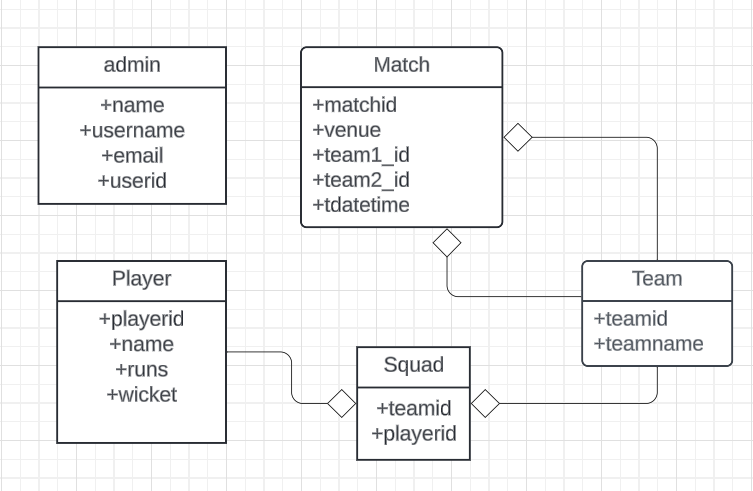
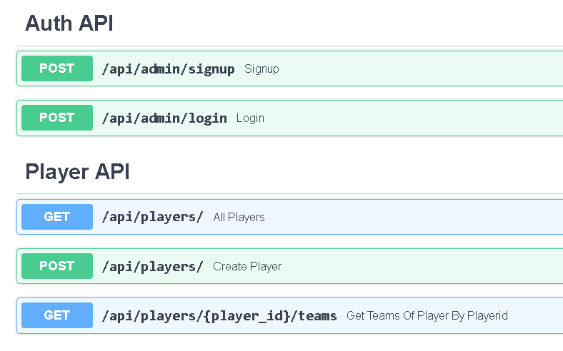
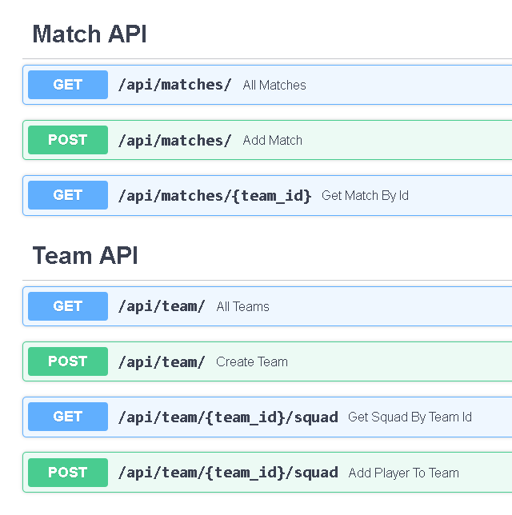

# CricBuzz

API endpoints created in FastAPI to register teams and players, and matches. The data is stored in PostgreSQL DB. The ORM used is SQLAlchemy. 

# DataBase Design



# API Endpoints





# Run the Project 

Create a project Folder and clone this Repository

```bash
    mkdir cricbuzz
    cd cricbuzz

    git clone <repository_url>
```
Install the dependencies

```bash
    pip install -r requirements.txt
```

Configure the dbsettings schema in app/schemas.py according
to the PGAdmin details of your Postgres DB. 

Run the project using uvicorn

```bash
    uvicorn main:app --reload
```

Run add_data.py to add some basic data:

```bash
python add_data.py
```
    